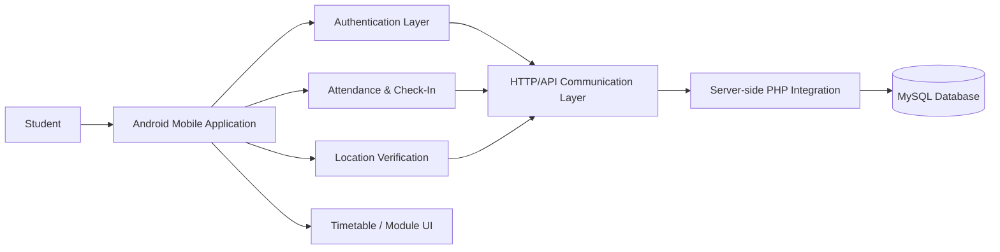
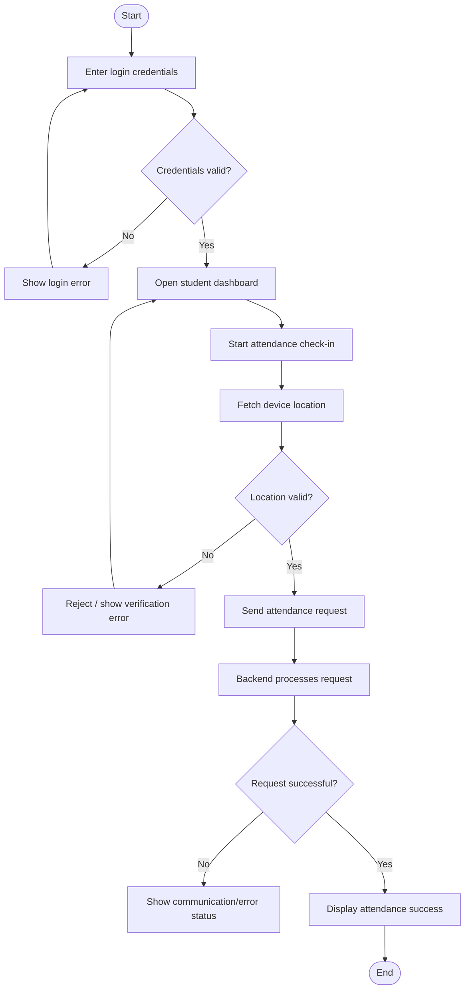
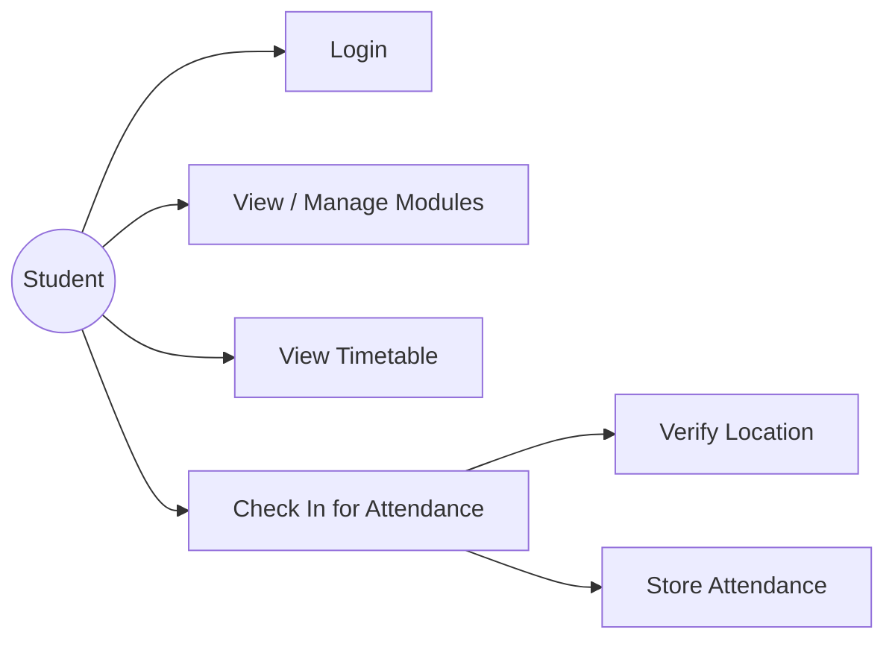
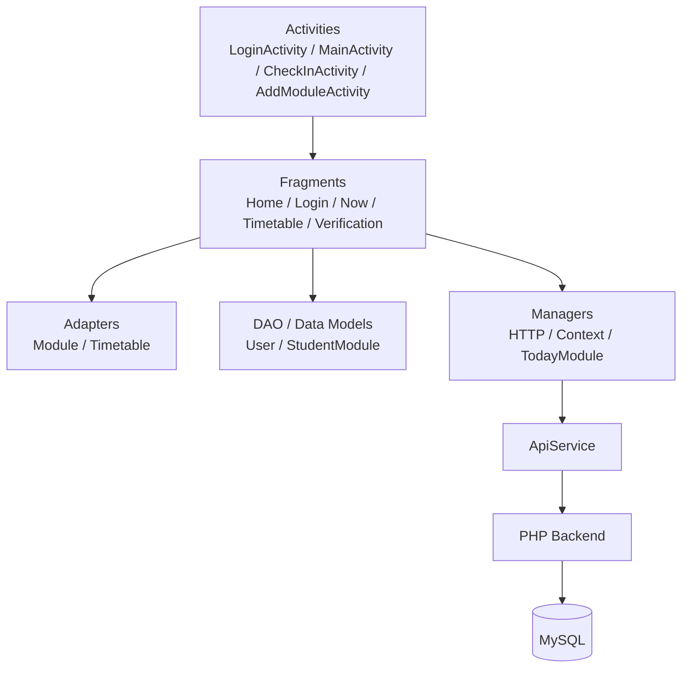
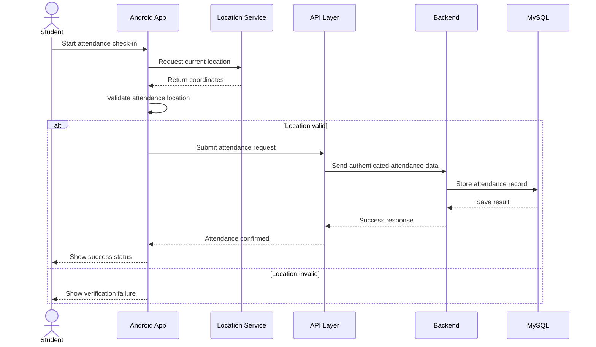
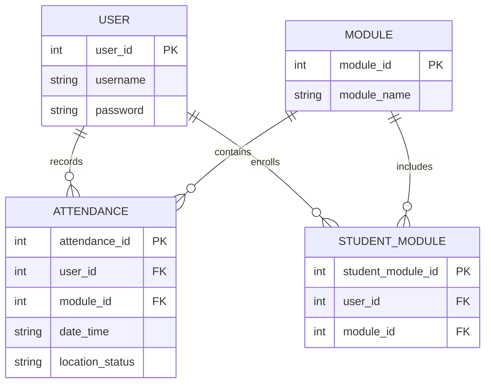

# Design and Testing Documentation

## 1. System Architecture

## 2. Process Flow

## 3. Use Case Diagram

## 4. Component/Class-Level Design

## 5. Sequence Diagram: Attendance Check-In

## 6. Data / ER Design

### Logical Schema

| Entity | Purpose | Key fields |
|---|---|---|
| User | Stores student identity/authentication data | user_id, username |
| Module | Stores course/module information | module_id, module_name |
| StudentModule | Associates students with modules | student_module_id, user_id, module_id |
| Attendance | Stores attendance/check-in records | attendance_id, user_id, module_id, date_time, location_status |

> The exact production database schema depends on the connected backend implementation. The diagram above is the logical design to document the application's data relationships.

## 7. Testing Approach

### Functional Testing
- Verify valid login credentials are accepted.
- Verify invalid credentials are rejected with controlled feedback.
- Verify timetable/module screens load correctly.
- Verify attendance check-in starts correctly.
- Verify location verification blocks an invalid location.
- Verify a valid verification result proceeds to the attendance request.
- Verify server/API failure is handled without application crash.

### Validation Testing
- Empty login fields should not be silently accepted.
- Missing/unavailable location should produce an understandable status.
- Network/API failure should be handled gracefully.

### Unit / Instrumentation Tests
The project includes Android test source files. Tests should be executed after importing the project into a compatible Android Studio/Gradle environment, because the supplied build configuration is an older Android project.

## 8. Design Decisions and Rationale

- **Android + Java:** Provides a native mobile environment for student attendance operations.
- **Location verification:** Adds a physical-presence check before attendance submission.
- **Layered organization:** Activities/fragments handle UI flow while adapters, DAO/model classes, managers, and API services separate responsibilities.
- **Backend database:** Allows attendance data to be persisted and accessed by the connected attendance system.
- **Git:** Provides version history and a reproducible project repository.
