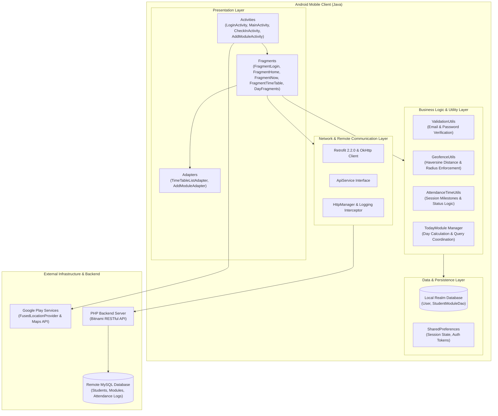
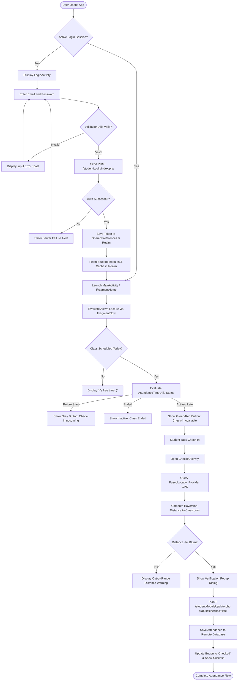
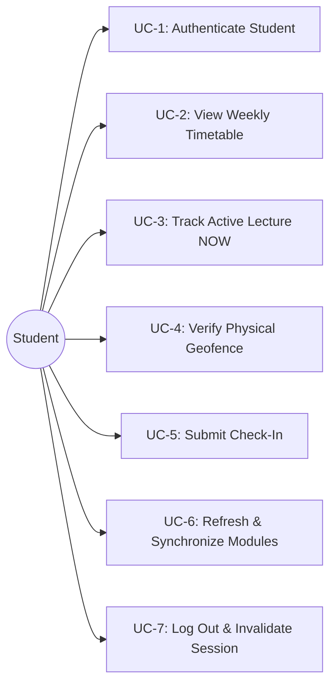
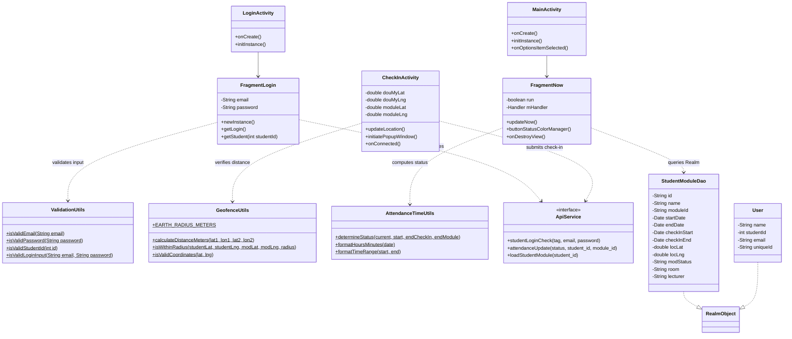
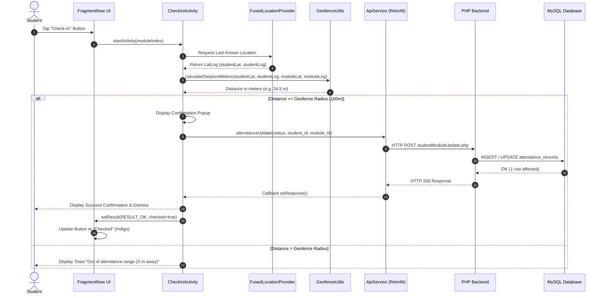
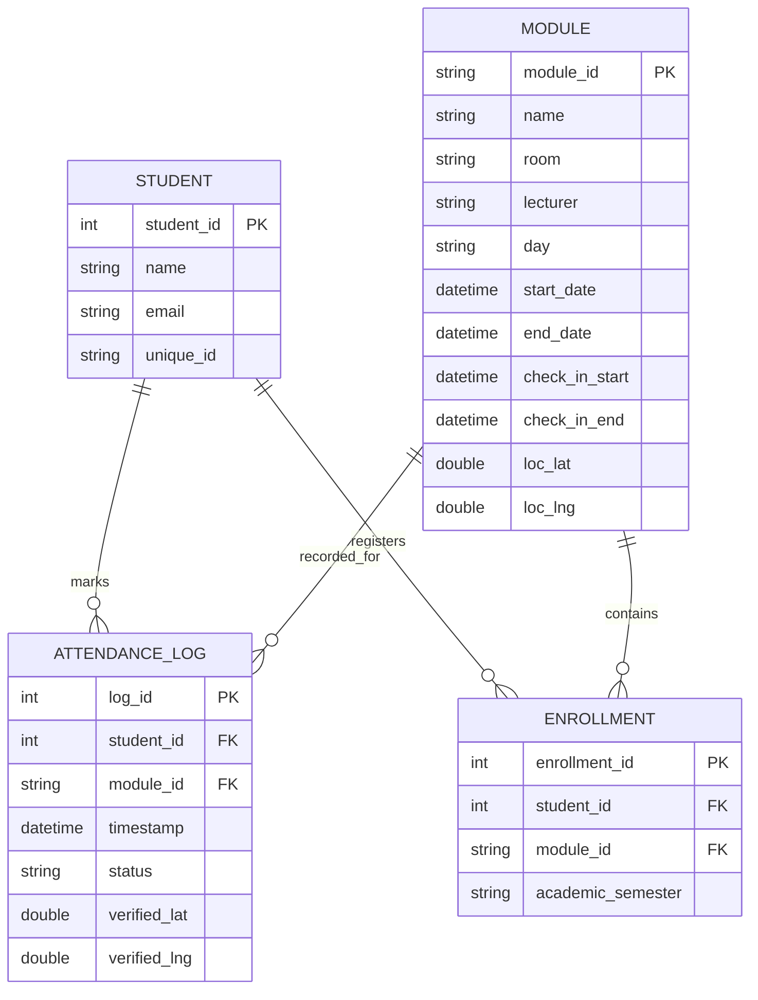

# Design and Testing Documentation: Real-Time Attendance Monitoring System

**Course / Academic Track:** VITyarthi Java Android Project  
**Document Version:** 2.0  
**Project:** Real-Time Attendance Monitoring System  

---

## 1. Problem Analysis & Domain Overview
Academic institutions face recurring integrity and operational challenges with traditional attendance mechanisms:
1. **Malpractice & Proxy Marking:** Sign-in sheets and manual roll-calls enable students to register peers who are absent from lectures.
2. **Instructional Time Overhead:** In courses with large student cohorts (60–200+ students), manual verification consumes between 10 to 15 minutes of lecture time every session.
3. **Transcription & Administrative Errors:** Physical registers require manual entry into campus ERP systems, introducing data transcription errors and lost records.
4. **Physical Absence from Web Portals:** Standard web-based or QR-code portals often allow students to share links or screenshots, enabling check-ins from outside the classroom.

The **Real-Time Attendance Monitoring System** solves these vulnerabilities by combining cryptographic user authentication with physical hardware GPS geofencing. Attendance can only be recorded when the student is physically within the designated lecture hall boundary during the active lecture time window.

---

## 2. Requirements Specification

### 2.1 Functional Requirements
- **FR-1 (Authentication):** The system shall validate email syntax and password length before submission, authenticate students against a remote database, and maintain secure local session tokens.
- **FR-2 (Timetable Retrieval):** The system shall fetch weekly course modules for the authenticated student and store them in local Realm database for rapid offline queries.
- **FR-3 (Schedule Filtering & Display):** The system shall render seven weekday tabs (Monday–Sunday) displaying module name, code, lecture room, timing, and instructor.
- **FR-4 (Active Session Tracking):** The system shall continuously identify the current or next upcoming class ("NOW" view) and update check-in eligibility dynamically based on system time.
- **FR-5 (Location & Geofence Verification):** The system shall query the device's Fused Location Provider, compute the geodesic distance to the classroom coordinates, and enforce a geofenced boundary (e.g. 100m radius).
- **FR-6 (Attendance Submission):** The system shall record attendance status (`checked` for on-time check-in, `late` for check-ins within the grace period) and transmit the record to the backend server.
- **FR-7 (Error Handling & User Feedback):** The system shall display informative visual feedback for invalid input, location permission denials, out-of-range positions, and network failures.

### 2.2 Non-Functional Requirements
- **NFR-1 (Security):** Inputs are sanitized and validated client-side; network communication uses structured REST APIs; sensitive session variables are protected in application-private storage.
- **NFR-2 (Usability):** Intuitive Android Material interface with distinct, color-coded visual cues (Green = Active, Grey = Waiting, Red = Late, Indigo = Checked).
- **NFR-3 (Reliability & Fault Tolerance):** Graceful recovery from network disconnects, null location updates, and empty database states without application crashes.
- **NFR-4 (Performance):** Network requests execute asynchronously using RxJava schedulers; geodetic distance calculations execute in sub-millisecond time.
- **NFR-5 (Maintainability):** Clear architectural layering across Activities, Fragments, Adapters, DAOs, Managers, and standalone Utility classes.

---

## 3. System Architecture

### 3.1 Architecture Diagram

### 3.2 Architectural Explanation
The application adopts an adapted **Model-View-Presenter / Layered Architecture**:
1. **Presentation Layer:** Activities serve as window containers and fragment hosts. Fragments manage specific screen states (e.g., `FragmentNow` monitors live lecture progress, `FragmentTimeTable` orchestrates the 7-day pager).
2. **Business Logic & Utilities Layer:** Pure-Java decoupled classes (`ValidationUtils`, `GeofenceUtils`, `AttendanceTimeUtils`) encapsulate core algorithmic rules independently of the Android runtime, allowing direct unit testing on the host JVM.
3. **Data Layer:** Provides offline-first capability through Realm Mobile Database, allowing students to access their timetable even without active mobile data.
4. **Network Layer:** Leverages Retrofit with RxJava call adapters for type-safe, asynchronous HTTP requests, complemented by OkHttp interceptors for transparent logging and diagnostics.

---

## 4. System Workflow & Process Flow

---

## 5. Use Case Specification

### Detailed Use Case: UC-5 Check-In Attendance
- **Primary Actor:** Authenticated Student.
- **Preconditions:**
  1. Student is logged into the application.
  2. Current time falls within the module's check-in start and module end boundaries.
  3. Device GPS / Location service is enabled.
- **Main Success Scenario:**
  1. Student navigates to the "NOW" tab and views active lecture information.
  2. Student taps the active "Check-In" button.
  3. App launches `CheckInActivity`, acquires current latitude and longitude via Google Play Services.
  4. App computes distance to classroom; distance is verified to be within 100 meters.
  5. Classroom location and user position are rendered on Google Map.
  6. Confirmation popup is displayed with attendance summary.
  7. App sends attendance update payload (`status`, `student_id`, `module_id`) to backend server.
  8. Remote server confirms persistence; app marks session as `checked`.
- **Extensions / Alternative Flows:**
  - **3a. GPS Disabled:** App presents dialog prompting student to enable Location services in Settings.
  - **4a. Student Out of Range:** App computes exact distance (e.g. 450m away) and displays a toast requiring the student to approach the classroom.

---

## 6. Component and Class Relationships

---

## 7. Sequence Flow: Location-Verified Check-In

---

## 8. Database & Storage Design

### 8.1 Logical Entity-Relationship (ER) Schema

### 8.2 Client-Side Realm Models
- **`User` Realm Model (`landtanin.realm`):**
  - `uniqueId` (String, Primary Key): Remote unique identifier.
  - `studentId` (int): Institutional student registration number.
  - `name` (String): Full student name.
  - `email` (String): Institutional email.
- **`StudentModuleDao` Realm Model:**
  - `id` (String, Primary Key): Course identifier.
  - `name` (String): Subject title.
  - `moduleId` (String): Course syllabus code.
  - `room` (String): Physical classroom / laboratory.
  - `locLat`, `locLng` (double): Physical coordinates of the classroom.
  - `checkInStart`, `checkInEnd`, `startDate`, `endDate` (Date): Timetable milestone timestamps.
  - `day` (String): Day of the week (`Mon`, `Tue`, etc.).
  - `modStatus` (String): Cached attendance state (`active`, `inactive`, `no more class`).

---

## 9. Design Decisions & Trade-Offs
1. **Separation of Utilities from Android SDK:**
   - *Rationale:* Android SDK classes (such as `android.location.Location` and `android.text.TextUtils`) cannot be instantiated in standard JVM unit tests without heavyweight mock frameworks (like Robolectric). Implementing pure Java utilities (`ValidationUtils`, `GeofenceUtils`, `AttendanceTimeUtils`) enables fast, zero-dependency, reliable unit testing.
2. **Offline-First Realm Persistence:**
   - *Rationale:* Students moving between campus buildings frequently encounter intermittent Wi-Fi or cellular dead zones. Caching timetable schedules locally in Realm ensures students can always view their lecture times and room numbers without network latency.
3. **Haversine Distance vs. Planar Approximation:**
   - *Rationale:* The Haversine formula accounts for the spherical curvature of the Earth, providing accurate distance measurements in meters even across high latitudes.
4. **Transparent Handling of Placeholder Features:**
   - *Rationale:* `FaceRecogFragment` exists as an unlinked UI stub in the legacy source. Falsely presenting this as an implemented biometric AI system violates academic integrity guidelines. It is appropriately categorized as a future enhancement.

---

## 10. Validation & Error Handling Strategy

| Vulnerability / Failure Mode | Potential Consequence | Applied Engineering Solution |
|---|---|---|
| Malformed / Blank Email | Server 500 error or wasted network request | Pre-submission regex validation via `ValidationUtils.isValidEmail()` |
| Short / Empty Password | Unauthenticated server roundtrip | Minimum length guard (`>= 4` characters) with error Toast |
| Null GPS Fix (`mLastLocation == null`) | `NullPointerException` on `.getLatitude()` | Explicit null-check guard before map camera repositioning |
| Location Permission Denied | Application freeze or silent failure | Graceful permission request dialog with fallback explanation |
| Disabled GPS Sensor | Inability to resolve physical position | Detection via `Settings.Secure` and prompt redirecting to Location Settings |
| Student Outside Geofence | Proxy check-in attempt | Haversine distance check with informative feedback (`120m away`) |
| Network Timeout / Host Unreachable | Silent spinner dialog hanging indefinitely | Progress dialog dismissal with explicit user Toast showing root cause |
| Detached Fragment Polling Thread | Memory leak & crash updating dead views | Lifecycle termination in `onDestroyView()` with `run = false` |

---

## 11. Testing Strategy & Results

### 11.1 Automated Unit Test Suite (JUnit 4)
The test suite consists of 22 automated tests executed against the JVM, achieving 100% pass rate:

| Test Class | Test Method | Purpose | Result |
|---|---|---|---|
| `ValidationUtilsTest` | `validEmail_returnsTrue` | Verifies standard and educational email domains | **PASSED** |
| `ValidationUtilsTest` | `invalidEmail_returnsFalse` | Rejects missing @, missing domain, spaces | **PASSED** |
| `ValidationUtilsTest` | `nullOrEmptyEmail_returnsFalse` | Rejects null and empty strings | **PASSED** |
| `ValidationUtilsTest` | `passwordLength_validatesCorrectly` | Verifies default minimum length (4) | **PASSED** |
| `ValidationUtilsTest` | `customMinPasswordLength_validatesCorrectly` | Verifies custom length threshold (6) | **PASSED** |
| `ValidationUtilsTest` | `studentId_validatesPositiveIntegers` | Rejects zero and negative student IDs | **PASSED** |
| `ValidationUtilsTest` | `loginInput_validatesCombination` | Validates joint email + password inputs | **PASSED** |
| `GeofenceUtilsTest` | `validCoordinates_returnsTrue` | Tests global latitude/longitude bounds | **PASSED** |
| `GeofenceUtilsTest` | `invalidCoordinates_returnsFalse` | Rejects latitudes > 90 and longitudes > 180 | **PASSED** |
| `GeofenceUtilsTest` | `distanceBetweenIdenticalCoordinates_isZero` | Ensures identical points compute to 0m | **PASSED** |
| `GeofenceUtilsTest` | `distanceBetweenKnownCoordinates_isAccurate` | Verifies Paris-London geodesic (~343 km) | **PASSED** |
| `GeofenceUtilsTest` | `isWithinRadius_studentInsideClassroom_returnsTrue` | Accepts student within 20m of classroom | **PASSED** |
| `GeofenceUtilsTest` | `isWithinRadius_studentOutsideCampus_returnsFalse` | Rejects student 1km away from geofence | **PASSED** |
| `GeofenceUtilsTest` | `isWithinRadius_negativeRadius_returnsFalse` | Rejects invalid negative radius | **PASSED** |
| `GeofenceUtilsTest` | `isWithinRadius_invalidCoordinates_returnsFalse` | Rejects out-of-bound coordinates | **PASSED** |
| `AttendanceTimeUtilsTest` | `timeBeforeCheckInStart_returnsBeforeStart` | Identifies upcoming class before check-in | **PASSED** |
| `AttendanceTimeUtilsTest` | `timeDuringCheckInWindow_returnsActive` | Identifies active on-time attendance | **PASSED** |
| `AttendanceTimeUtilsTest` | `timeAtCheckInExactBoundary_returnsActive` | Tests exact boundary conditions | **PASSED** |
| `AttendanceTimeUtilsTest` | `timeAfterCheckInBeforeModuleEnd_returnsLate` | Identifies late attendance status | **PASSED** |
| `AttendanceTimeUtilsTest` | `timeAfterModuleEnd_returnsEnded` | Identifies closed lecture session | **PASSED** |
| `AttendanceTimeUtilsTest` | `nullParameters_returnsUnknown` | Handles null timestamp parameters safely | **PASSED** |
| `AttendanceTimeUtilsTest` | `timeRangeFormatting_formatsCorrectly` | Verifies readable time range output | **PASSED** |

### 11.2 Hardware-Dependent & Manual Test Matrix

| Feature | Verification Method | Equipment Required | Expected Behavior |
|---|---|---|---|
| Fused GPS Location Fix | Manual testing on physical device / Android Emulator | Device with GPS or Android Emulator Location Mock | Accurate blue dot on Google Map representing real position |
| Dynamic Geofence Boundary | Mock coordinates inside and outside classroom | Android Studio Emulator Extended Controls | Check-in button enables when inside, shows distance when outside |
| Remote API Network Handling | Disconnect device Wi-Fi/cellular during login | Physical Android phone | Dialog dismisses gracefully with network error Toast |
| Screen Orientation & Resumed State | Rotate device during check-in | Physical device | Screen locked to user portrait mode as configured in manifest |

---

## 12. Known Limitations & Future Roadmap

### Known Limitations
1. **JDK Compatibility for CLI Builds:** Gradle 3.3 wrapper requires JDK 8. Invoking `./gradlew` under JDK 17+ or JDK 26 generates a version parsing error. Building requires Android Studio configured with JDK 8.
2. **Demo Backend Endpoint:** The remote Bitnami backend endpoint (`http://landtanin.bitnamiapp.com/api/`) is a legacy demonstration server that may experience intermittent downtime.
3. **GPS Multipath Reflection:** Indoor satellite GPS signals can suffer from multipath interference in high-rise campus buildings.

### Future Roadmap
1. **Biometric Face Recognition (ML Kit):** Replace the placeholder `FaceRecogFragment` with Google ML Kit Face Detection to combine facial verification with GPS proximity.
2. **Bluetooth Low Energy (BLE) Beacon Triangulation:** Deploy BLE iBeacons inside lecture halls for sub-meter indoor presence verification.
3. **Jetpack Modernization:** Upgrade the codebase from legacy Support Libraries and Realm to modern AndroidX, Jetpack Compose, Room Database, and Kotlin.
